# Gallery

Generated by `scripts/make_gallery.py` — every image is the real production dashboard of a real build (geometry, pixels, wiring, seams).

### open-neon

Neon tubes, V8 facet lens, 17mm pixels, H2D — 675×188 mm · 4 piece(s) · 81 px · 568 g

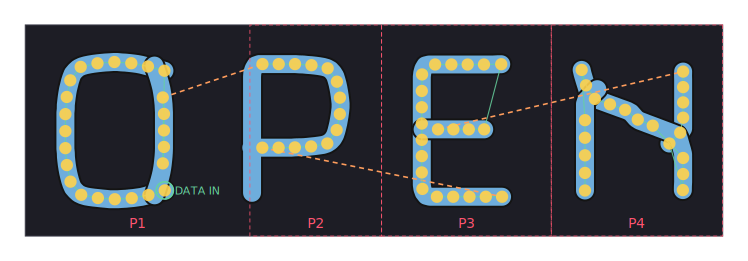

### cafe-channel

Channel letters, press-fit faces, no backer — 491×140 mm · 2 piece(s) · 0 px · 385 g

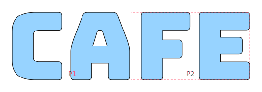

### halo-b

Halo/backlit letter, rear pixel racetrack, standoffs — 128×150 mm · 1 piece(s) · 45 px · 123 g

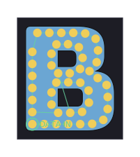

### star-shape

SVG shape art through the neon skeletonizer — 212×200 mm · 1 piece(s) · 39 px · 133 g

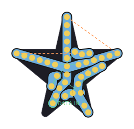

### script-neon

Script font (Pacifico) as connected neon — 362×232 mm · 2 piece(s) · 66 px · 384 g

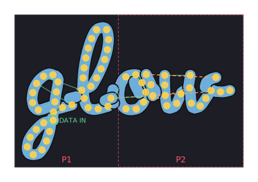

## Example artworks (examples/art/*.svg)

Ten hand-drawn 1950s motifs through the neon pipeline — outline tubes with
per-component spine fallback, mixed fill+stroke support, plaque catalog,
palettes. Regenerate: the sweep script in tests/test_examples.py (slow marks).

| | |
|---|---|
| 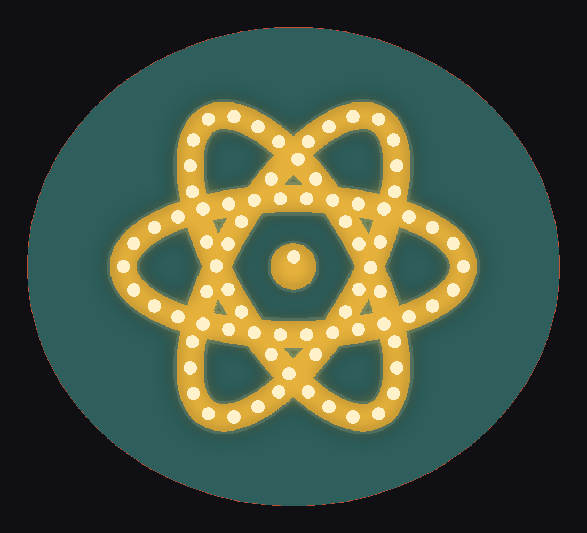 | 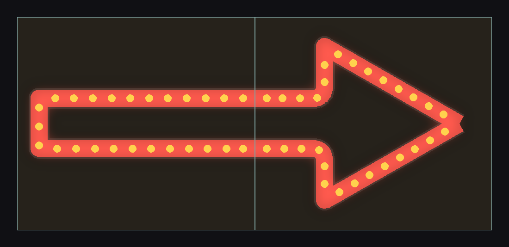 |
| 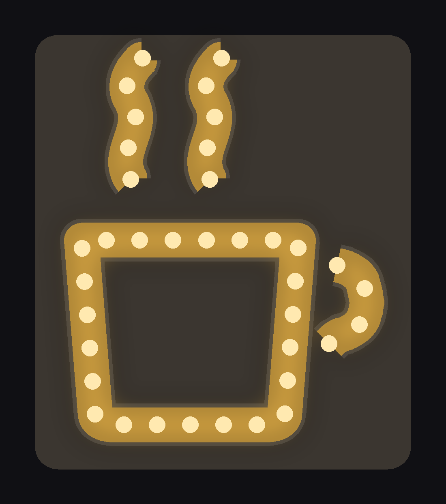 | 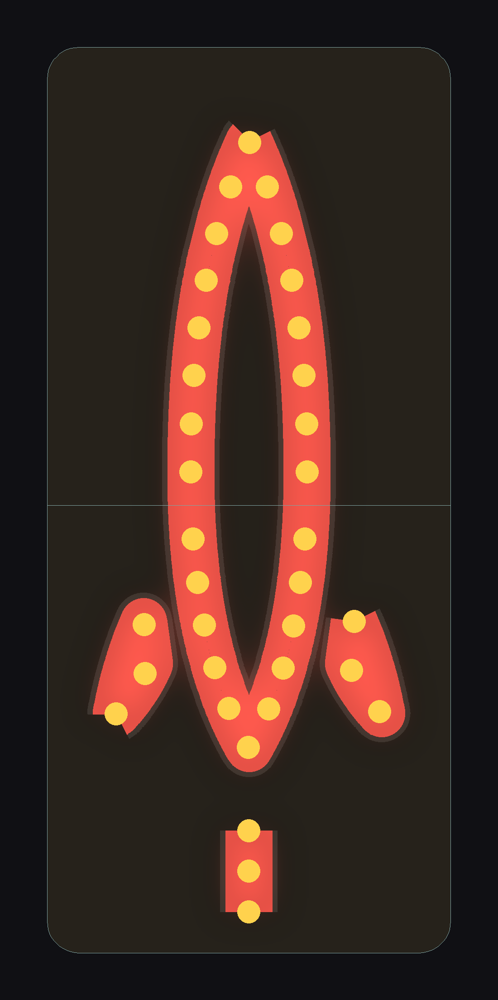 |
| 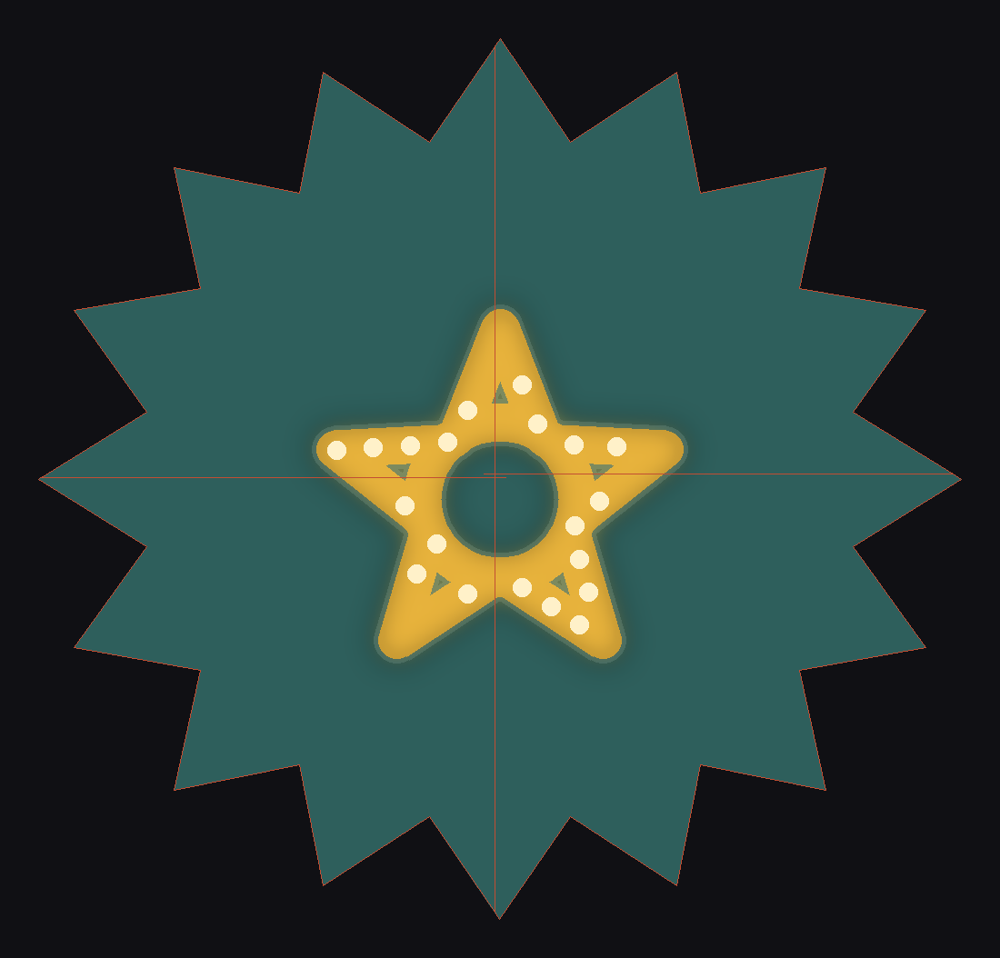 |  |
| 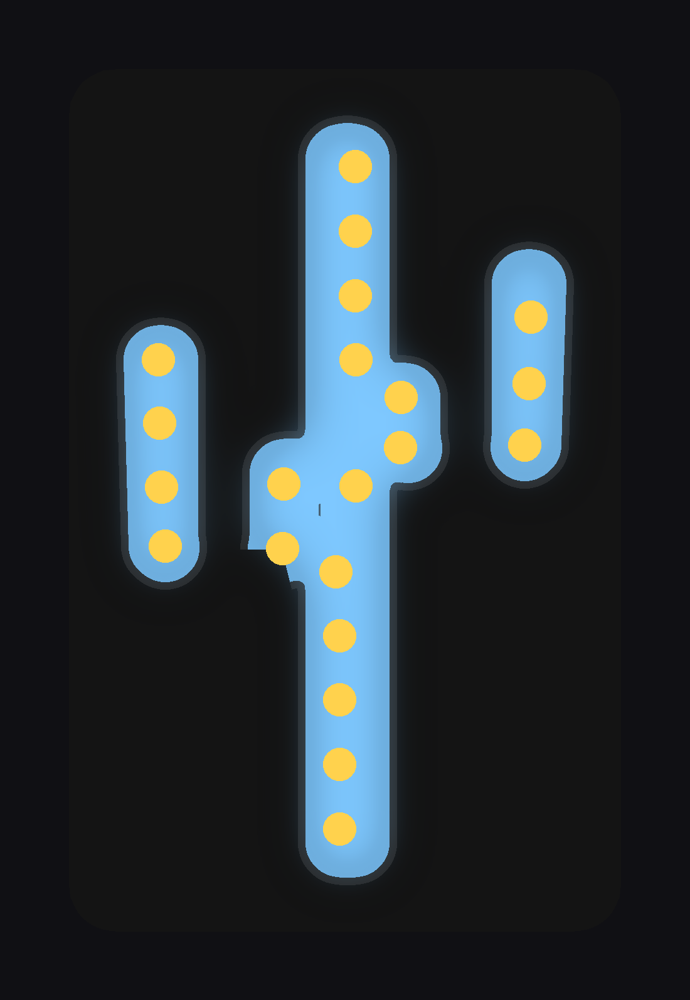 | 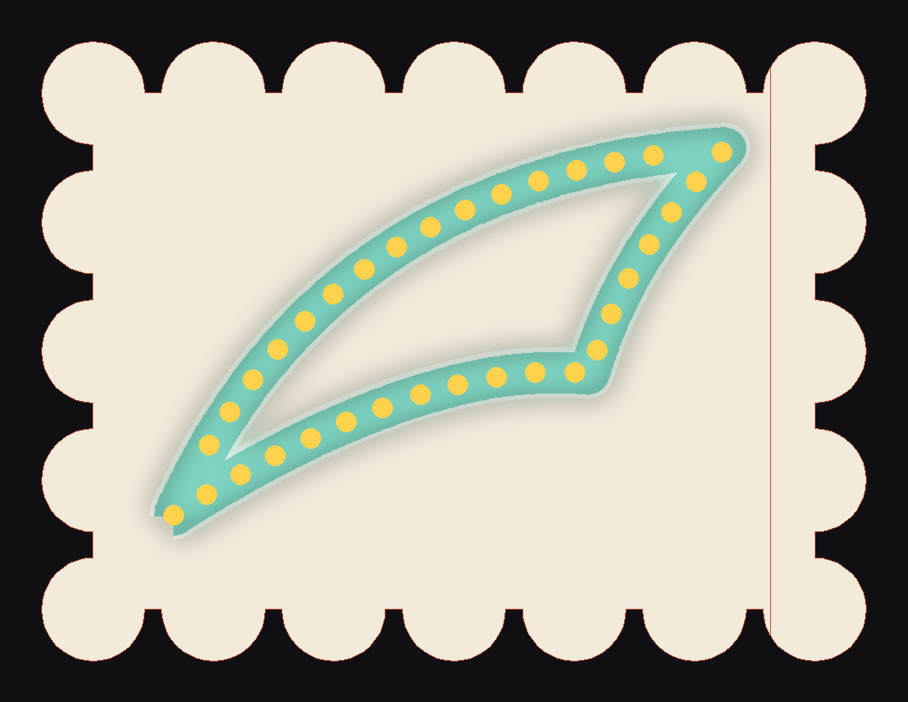 |
| 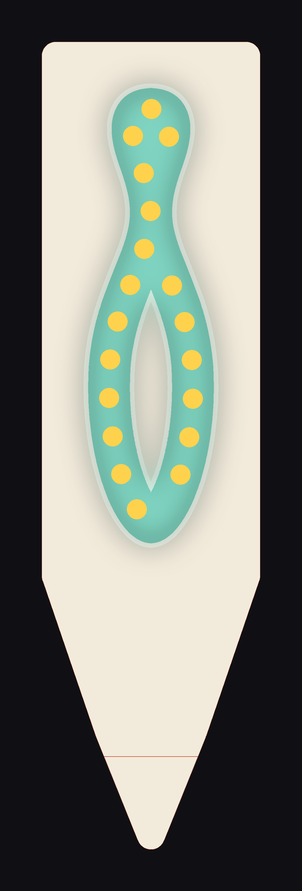 | 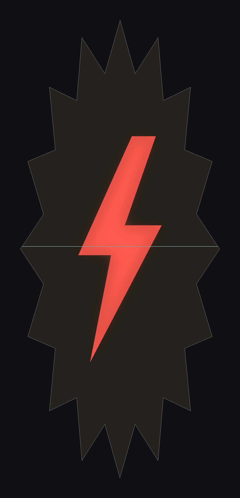 |
